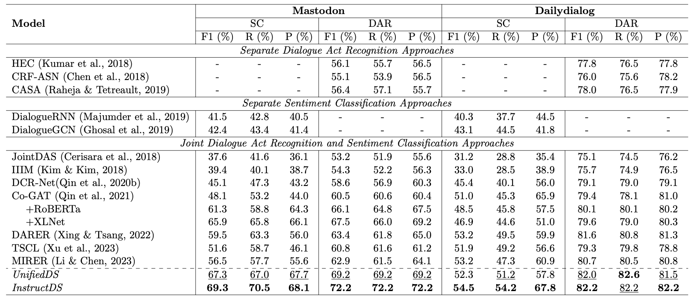

# InstructDS: Multi-task Instruction Tuning for Unified Dialogue Act Recognition and Sentiment Classification

## Abstract

Dialogue act recognition and dialogue sentiment classification are closely related tasks in dialogue language understanding. Existing joint models all heavily rely on a complex multi-task classification paradigm to capture shared knowledge across tasks, which greatly hinders the cross-task and cross-domain generalization (with new task or domain label schema). To solve the problem, in this work, we first reformulate the classification tasks into a unified generative framework (UnifiedDS}), aiming to capture the inter-task dependency. Then, we further introduce a multi-task instruction tuning method based on a generative framework (InstructDS) to achieve better generalization across tasks and domains. Experimental results on two standard benchmarks (i.e., Mastodon and Dailydialog) show that both UnifiedDS and InstructDS achieve state-of-the-art performance and are capable of generalizing to new domains or tasks. 
To the best of our knowledge, this is the first exploration of instruction tuning on dialogue act recognition and sentiment classification.

## Results



## Preparation

Our code is based on Python 3.8.13 and PyTorch 1.11 Required python packages:

-   numpy==1.23.1
-   progressbar==2.5
-   tqdm==4.64.0
-   torch==1.11.0
-   transformers==4.25.1
-   wandb==0.14.1
-   scikit-learn==1.0.2

We highly suggest you using [Anaconda](https://www.anaconda.com/) to manage your python environment. If so, you can run the following command directly on the terminal to create the environment:

```
conda create -n env_name python=3.8.13  
source activate env_name     
pip install -r requirements.txt
```

## How to run it
The script **learn.py** acts as a main function to the project, you can run the experiments by the following commands.

```Shell
# Run UnifiedDS on Mastodon
python -u learn.py --data_prefix 'dataset/mastodon' --learning_rate 3e-5 --model_name 'flan-t5-base' --pretrained_path 'google/flan-t5-base' --save_path 'ckpt/mastodon_unifiedDS' --num_train_epochs 200 --log_name 'mastodon_unifiedDS' > mastodon_unifiedDS.log 2>&1 & 

# Run InstructDS on Mastodon
python -u learn.py --data_prefix 'dataset/mastodon' --learning_rate 3e-5 --model_name 'flan-t5-base' --pretrained_path 'google/flan-t5-base' --save_path 'ckpt/mastodon_instructDS' --num_train_epochs 200 --ins --log_name 'mastodon_instructDS' > mastodon_instructDS.log 2>&1 & 


# Run UnifiedDS on Dailydialogue
python -u learn.py --data_prefix 'dataset/dailydialogue' --learning_rate 1e-5 --model_name 'flan-t5-base' --pretrained_path 'google/flan-t5-base' --save_path 'ckpt/dailydialogue_unifiedDS' --num_train_epochs 50 --log_name 'dailydialogue_unifiedDS' > dailydialogue_unifiedDS.log 2>&1 & 

# Run InstructDS on Dailydialogue
python -u learn.py --data_prefix 'dataset/dailydialogue' --learning_rate 1e-5 --model_name 'flan-t5-base' --pretrained_path 'google/flan-t5-base' --save_path 'ckpt/dailydialogue_instructDS' --num_train_epochs 50 --ins --log_name 'dailydialogue_instructDS' > dailydialogue_instructDS.log 2>&1 & 

```

If you have any question, please issue the project or email [Shijue Huang](mailto:joehsj310@gmail.com) and we will reply you soon.